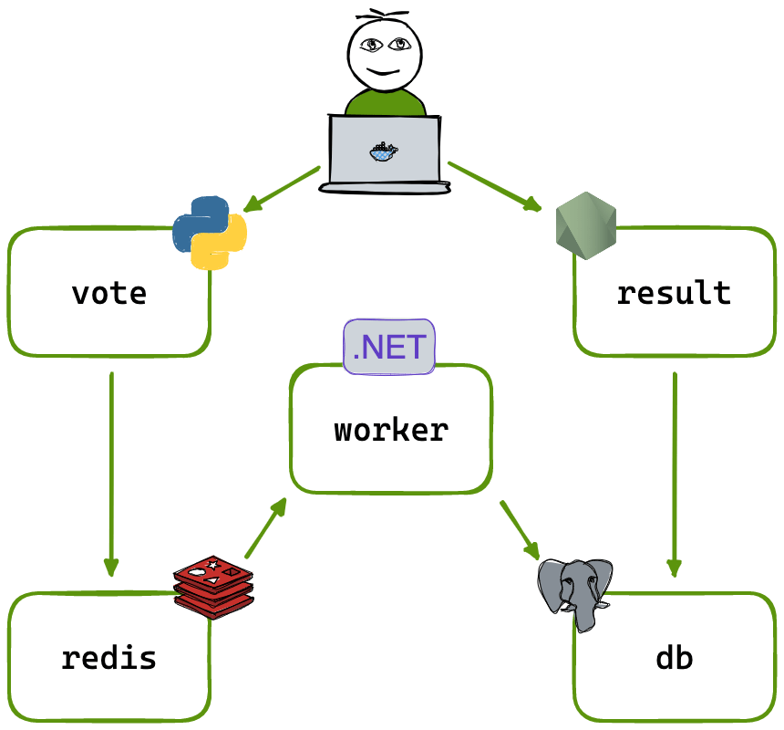
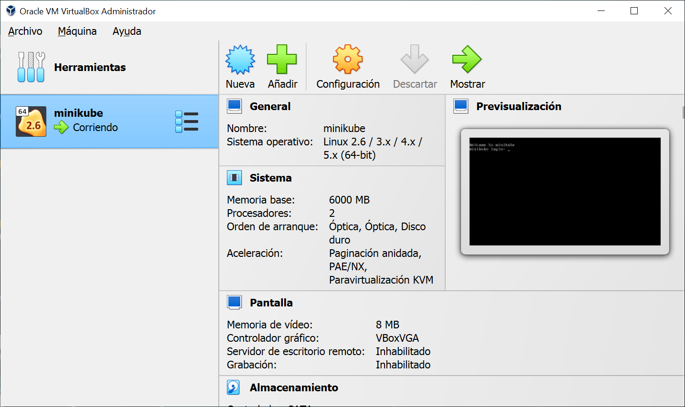
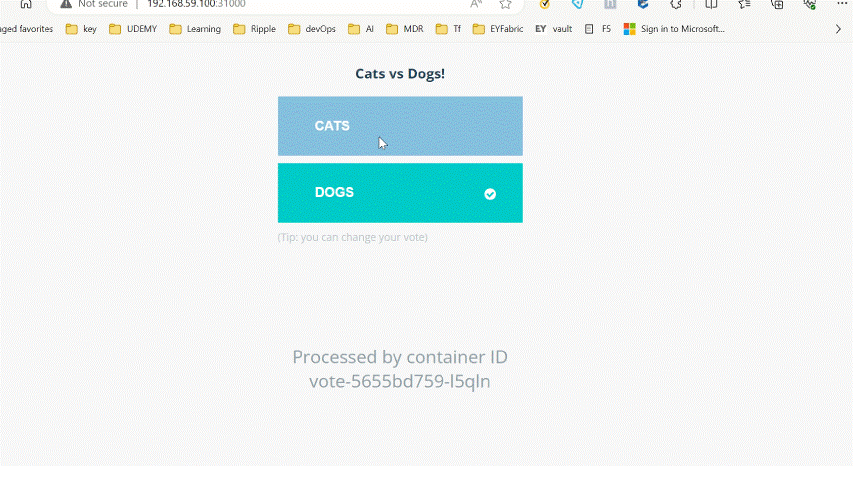

# Example Voting App 

Deploying microservices application on Kubernetes with Deployments. (Lab of the course:Kubernetes for the Absolute Beginners - Hands-on)

## Run the app in Kubernetes

The folder voting-app contains the YAML specifications of the Voting App's services.

Run the following command to create the deployments and services. Note it will create these resources in your current namespace (`default` if you haven't changed it.)

```shell
kubectl create -f voting-app-deployment.yaml
```
```shell
kubectl create -f voting-app-service.yaml
```
```shell
kubectl create -f redis-deployment.yaml
```
```shell
kubectl create -f redis-service.yaml
```
```shell
kubectl create -f postgres-deployment.yaml
```
```shell
kubectl create -f postgres-service.yaml
```
```shell
kubectl create -f worker-app-deployment.yaml
```
```shell
kubectl create -f result-app-deployment.yaml
```
```shell
kubectl create -f result-app-service.yaml
```

The `vote` web app is then available on port 31000 on each host of the cluster, the `result` web app is available on port 31001.

To remove them, run:

```shell
kubectl delete -f voting-app/
```

## Architecture





* A front-end web app in [Python](/vote) which lets you vote between two options
* A [Redis](https://hub.docker.com/_/redis/) which collects new votes
* A [.NET](/worker/) worker which consumes votes and stores them in…
* A [Postgres](https://hub.docker.com/_/postgres/) database backed by a Docker volume
* A [Node.js](/result) web app which shows the results of the voting in real time

## Notes

The voting application only accepts one vote per client browser. It does not register additional votes if a vote has already been submitted from a client.

This isn't an example of a properly architected perfectly designed distributed app... it's just a simple example of the various types of pieces and languages you might see (queues, persistent data, etc), and how to deal with them in Kubernetes at a basic level.